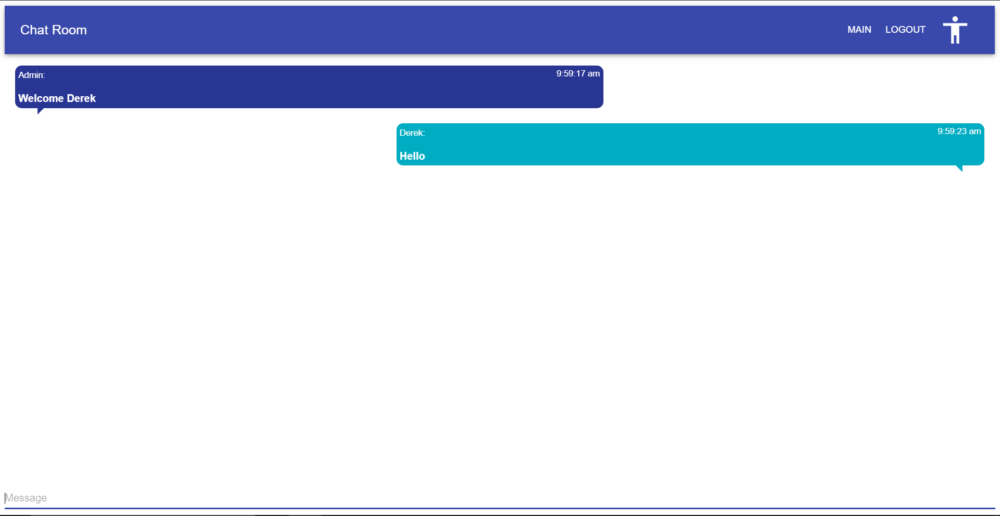

# ChatRoom

React based web application that allows the users to type messages to each other in socket based chat rooms.

## Installation

### Backend

```
Install the backend: npm install
```

### Frontend

```
Install the frontend: npm install
```

## Usage

### Backend

```
Start the backend: node src/app.js
```

### Frontend

```
Start the frontend: npm run start
```


